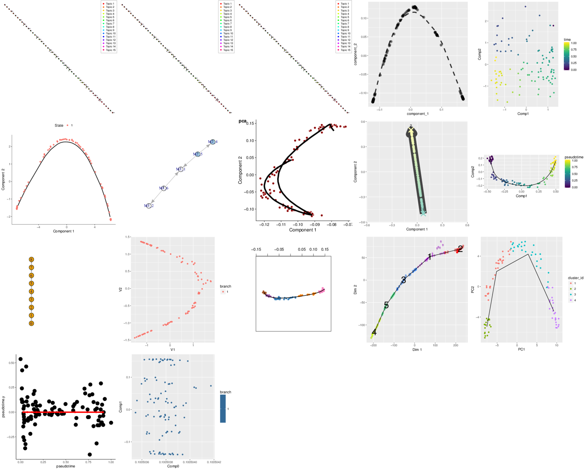

<!-- README.md is generated from README.Rmd. Please edit that file -->
An evaluation framework for trajectory inference methods
========================================================




The goal of dynalysis is to ...

### Citation

Please cite this compendium as:

> Authors, (2018). *Title of compendium*. Accessed 29 Mar 2018. Online at <https://doi.org/xxx/xxx>

### Dependencies

You might have to install a few packages.

Ubuntu/Debian:

    sudo apt-get install libudunits2-dev libgsl-dev libsdl1.2-dev libreadline-dev imagemagick libfftw3-dev libudunits2-dev librsvg2-dev -y
    sudo apt-get install python2.7-dev python3-dev python3-pip
    pip3 install --user virtualenv numpy matplotlib pandas six jinja2 python-dateutil pytz pyparsing cycler tqdm python-igraph rpy2 Cython scipy statsmodels sklearn seaborn

Fedora/CentOS:

    sudo dnf install openssl-devel libcurl-devel udunits2-devel libxml2-devel gsl-devel SDL2-devel readline-devel ImageMagick-c++-devel SDL-devel python2-devel python3-devel python3-pip python3-matplotlib-tk openblas-devel lapack-devel librsvg2-devel
    pip3 install --user virtualenv numpy matplotlib pandas six jinja2 python-dateutil pytz pyparsing cycler tqdm python-igraph rpy2 Cython scipy statsmodels sklearn seaborn
    Rscript -e 'install.packages("udunits2", configure.args =  c(udunits2 = '--with-udunits2-include=/usr/include/udunits2'))'

macOS:

Install SDL2 and SDL1.2 manually.

Install `librsvg` with brew.

### Installation

You can install dynalysis from github with:

``` r
install.packages("devtools")
setRepositories(ind = 1:2)
devtools::install_github("Zouter/dynalysis", dependencies = T, upgrade = T)
```

### Running

To run locally, install `docker` and run `docker build -t dynalysis .`

### Licenses

**Text and figures:** [CC-BY-4.0](http://creativecommons.org/licenses/by/4.0/)

**Code:** See the [DESCRIPTION](DESCRIPTION) file

**Data:** [CC-0](http://creativecommons.org/publicdomain/zero/1.0/) attribution requested in reuse

### Contributions

We welcome contributions from everyone. Before you get started, please see our [contributor guidelines](CONTRIBUTING.md). Please note that this project is released with a [Contributor Code of Conduct](CONDUCT.md). By participating in this project you agree to abide by its terms.
