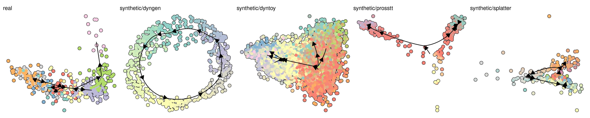

<!-- README.md is generated from README.Rmd. Please edit that file -->

[](https://travis-ci.org/dynverse/dynbenchmark)

[](https://doi.org/10.1038/s41587-019-0071-9)
[**ℹ️ Tutorials**](https://dynverse.org)  
<br>

# Benchmarking trajectory inference methods

This repo contains the scripts to reproduce the manuscript

> A comparison of single-cell trajectory inference methods 
> <strong> Wouter Saelens\* </strong>
> <a href='https://orcid.org/0000-0002-7114-6248'></a>
> <a href='https://github.com/zouter'></a>,
> <strong> Robrecht Cannoodt\* </strong>
> <a href='https://orcid.org/0000-0003-3641-729X'></a>
> <a href='https://github.com/rcannood'></a>,
> Helena Todorov
> <a href='https://github.com/Helena-todd'></a>,
> <em> Yvan Saeys </em>
> <a href='https://github.com/saeyslab'></a>  
> [doi:10.1038/s41587-019-0071-9](https://doi.org/10.1038/s41587-019-0071-9)
> [](https://altmetric.com/details/33972849)

## Dynverse

Under the hood, dynbenchmark makes use of most dynverse package for
running the methods, comparing them to a gold standard, and plotting the
output. Check out **[dynverse.org](https://dynverse.org)** for an
overview\!

## Experiments

From start to finish, the repository is divided into several
experiments, each with their own scripts and results. These are
accompanied by documentation using github readmes and can thus be easily
explored by going to the appropriate
folders:

| \# | id                       | scripts                                   | results                                                                                        |
| :- | :----------------------- | :---------------------------------------- | :--------------------------------------------------------------------------------------------- |
| 1  | Datasets                 | [📄➡](scripts/01-datasets)                 | [📊➡](https://github.com/dynverse/dynbenchmark_results/tree/master/01-datasets)                 |
| 2  | Metrics                  | [📄➡](scripts/02-metrics)                  | [📊➡](https://github.com/dynverse/dynbenchmark_results/tree/master/02-metrics)                  |
| 3  | Methods                  | [📄➡](scripts/03-methods)                  | [📊➡](https://github.com/dynverse/dynbenchmark_results/tree/master/03-methods)                  |
| 4  | Method testing           | [📄➡](scripts/04-method_testing)           | [📊➡](https://github.com/dynverse/dynbenchmark_results/tree/master/04-method_testing)           |
| 5  | Scaling                  | [📄➡](scripts/05-scaling)                  | [📊➡](https://github.com/dynverse/dynbenchmark_results/tree/master/05-scaling)                  |
| 6  | Benchmark                | [📄➡](scripts/06-benchmark)                | [📊➡](https://github.com/dynverse/dynbenchmark_results/tree/master/06-benchmark)                |
| 7  | Stability                | [📄➡](scripts/07-stability)                | [📊➡](https://github.com/dynverse/dynbenchmark_results/tree/master/07-stability)                |
| 8  | Summary                  | [📄➡](scripts/08-summary)                  | [📊➡](https://github.com/dynverse/dynbenchmark_results/tree/master/08-summary)                  |
| 9  | Guidelines               | [📄➡](scripts/09-guidelines)               | [📊➡](https://github.com/dynverse/dynbenchmark_results/tree/master/09-guidelines)               |
| 10 | Benchmark interpretation | [📄➡](scripts/10-benchmark_interpretation) | [📊➡](https://github.com/dynverse/dynbenchmark_results/tree/master/10-benchmark_interpretation) |
| 11 | Example predictions      | [📄➡](scripts/11-example_predictions)      | [📊➡](https://github.com/dynverse/dynbenchmark_results/tree/master/11-example_predictions)      |
| 12 | Manuscript               | [📄➡](scripts/12-manuscript)               | [📊➡](https://github.com/dynverse/dynbenchmark_results/tree/master/12-manuscript)               |
|    | Varia                    | [📄➡](scripts/varia)                       |                                                                                                |

We also have several additional subfolders:

  - [Manuscript](manuscript): Source files for producing the manuscript.
  - [Package](package): An R package with several helper functions for
    organizing the benchmark and rendering the manuscript.
  - [Raw](raw): Files generated by hand, such as figures and
    spreadsheets.
  - [Derived](derived): Intermediate data files produced by the scripts.
    These files are not git committed.

## Guidelines

Based on the results of the benchmark, we provide context-dependent user
guidelines, [available as a shiny
app](https://github.com/dynverse/dynguidelines). This app is integrated
within the [dyno pipeline](https://github.com/dynverse/dyno), which also
includes the wrappers used in the benchmarking and other packages for
visualising and interpreting the
results.

[](https://github.com/dynverse/dynguidelines)

## Datasets

The benchmarking pipeline generates (and uses) the following datasets:

  - **Gold standard single-cell datasets**, both real and synthetic,
    used to evaluated the trajectory inference methods
    [](https://doi.org/10.5281/zenodo.1443566)



  - **The performance of methods** used for the [results overview
    figure](https://github.com/dynverse/dynbenchmark_results/tree/master/08-summary/results_suppfig.pdf)
    and the [dynguidelines](http://guidelines.dynverse.org) app.

  - **General information about trajectory inference methods**,
    available as a data frame in `dynmethods::methods`

## Methods

All wrapped methods are wrapped as both docker and singularity
containers. These can be easily run using
[*dyn*methods](https://github.com/dynverse/dynmethods).

## Installation

dynbenchmark has been tested using R version 3.5.1 on Linux. While
running the methods also works on on Windows and Mac (see
[dyno](https://github.com/dynverse/dyno)), running the benchmark is
currently not supported on these operating system, given that a lot of
commands are linux specific.

In R, you can install the dependencies of dynbenchmark from github
using:

``` r
# install.packages("devtools")
devtools::install_github("dynverse/dynbenchmark/package")
```

This will install several other “dynverse” packages. Depending on the
number of R packages already installed, this installation should take
approximately 5 to 30 minutes.

On Linux, you will need to install udunits and ImageMagick:

  - Debian / Ubuntu / Linux Mint: `sudo apt-get install libudunits2-dev
    imagemagick`
  - Fedora / CentOS / RHEL: `sudo dnf install udunits2-devel
    ImageMagick-c++-devel`

[Docker](https://docs.docker.com/install) or
[Singularity](https://www.sylabs.io/guides/3.0/user-guide/) (version ≥
3.0) has to be installed to run TI methods. We suggest docker on Windows
and MacOS, while both docker and singularity are fine when running on
linux. Singularity is strongly recommended when running the method on
shared computing clusters.

For windows 10 you can install [Docker
CE](https://store.docker.com/editions/community/docker-ce-desktop-windows),
older Windows installations require the [Docker
toolbox](https://docs.docker.com/toolbox/overview/).

You can test whether docker is correctly installed by
    running:

``` r
dynwrap::test_docker_installation(detailed = TRUE)
```

    ## ✔ Docker is installed

    ## ✔ Docker daemon is running

    ## ✔ Docker is at correct version (>1.0): 1.39

    ## ✔ Docker is in linux mode

    ## ✔ Docker can pull images

    ## ✔ Docker can run image

    ## ✔ Docker can mount temporary volumes

    ## ✔ Docker test successful -----------------------------------------------------------------

    ## [1] TRUE

Same for
    singularity:

``` r
dynwrap::test_singularity_installation(detailed = TRUE)
```

    ## ✔ Singularity is installed

    ## ✔ Singularity is at correct version (>=3.0): v3.0.0-13-g0273e90f is installed

    ## ✔ Singularity can pull and run a container from Dockerhub

    ## ✔ Singularity can mount temporary volumes

    ## ✔ Singularity test successful ------------------------------------------------------------

    ## [1] TRUE

These commands will give helpful tips if some parts of the installation
are missing.
