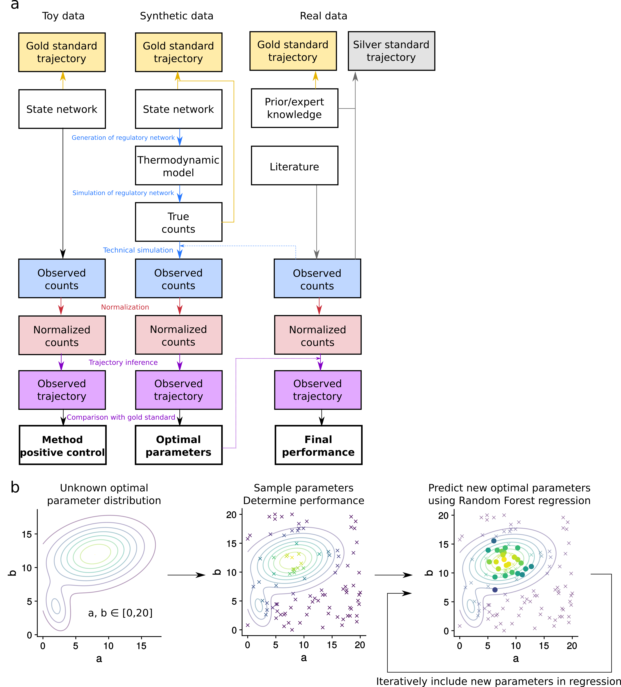

\* Equal contribution  
¹ Data mining and modelling for biomedicine, VIB Center for Inflammation Research, Ghent, Belgium.  
² Department of Applied Mathematics, Computer Science and Statistics, Ghent University, Ghent, Belgium.  
³ Center for Medical Genetics, Ghent University Hospital, Ghent, Belgium.  
⁴ CIRI, Centre International de Recherche en Infectiologie, Inserm, Lyon, France.  
⁵ Université Claude Bernard Lyon 1, Lyon, France.  

```{r setup, include=FALSE}
knitr::opts_knit$set(root.dir = rprojroot::find_rstudio_root_file())
knitr::opts_chunk$set(
  collapse = TRUE,
  warning = FALSE,
  message = FALSE,
  echo = FALSE,
  comment = "#>",
  fig.path = ".scratch/"
)

library(dynalysis)
library(tidyverse)
library(cowplot)

# refering to figures & supplementary figures
refs <- tibble(ref_id = character(), name = character(), ref_type = character())
ref <- function(ref_type, ref_id, suffix="", anchor=FALSE) {
  if(nrow(refs %>% filter(ref_id == !!ref_id)) == 0) {
    refs <<- refs %>% bind_rows(tibble(
      name = create_names[[ref_type]](sum(refs$ref_type == ref_type) + 1),
      ref_type = ref_type,
      ref_id = ref_id
    ))
  }
  ref <- refs %>% filter(ref_id == !!ref_id) %>% 
    pull(name) %>% 
    {pritt("[**{.}{suffix}**](#{ref_type}_{ref_id})")}
  
  if (anchor) ref <- pritt("{ref}<a name='{ref_type}_{ref_id}'></a>")
  ref
}
create_names <- list(
  sfig = function(i) pritt("Supplementary Figure {i}"),
  fig = function(i) pritt("Figure {i}"),
  snote = function(i) pritt("Supplementary Note {i}")
)
```
<!----
Tips for working in this document:
* Go to tools -> perferences and remove Use smart quotes
* Add enters after every paragraph (this is markdown!)


TITLES: 
Not all trajectory inference methods are created equal
Trajectory inference: work in progress
Trajectory inference: we’re not quite there yet
Paving the way for trajectories
Benchmarking trajectory inference methods
Bringing single-cell trajectory inference methods to the next level
Resolving disarray amongst trajectory inference methods with a comprehensive evaluation
A comparison of trajectory inference methods
Trajectory inference 2.0
We’re on the trajectory to better trajectory inference methods
On the road to more accurate and robust single-cell trajectory inference methods
Towards more accurate and robust single-cell trajectory inference methods
On the trajectory to more accurate,robust and trajectory-like single-cell trajectory inference method trajectories
A comparison of single-cell trajectory inference methods: towards more accurate and robust tools
--->


# Introduction


Single-cell[a] -omics technologies now make it possible to more accurately model biological systems than ever before. One area where single-cell data can be particularly useful is in the study of cellular dynamic processes, such as the cell cycle, cell differentiation and cell activation. When cells are sampled from a population in which cells are at different unknown points in the dynamic process, trajectory inference methods can be used to computationally order these cells along their dynamic process [@cannoodt_computational_2016]. Because they offer an unbiased and transcriptome-wide understanding of the dynamic process, trajectories then allow the identification new (primed) subsets of cells, delineation the exact wiring of a differentiation tree and inference of regulatory interaction responsible for a bifurcation refs.


```{r, fig.width = 15, fig.height = 10}
n_methods_over_time <- readRDS(figure_file("n_methods_over_time.rds", experiment_id="method_characteristics"))
trajectory_components_over_time <- readRDS(figure_file("trajectory_components_over_time.rds", experiment_id="method_characteristics"))


cowplot::plot_grid(plotlist=list(n_methods_over_time, trajectory_components_over_time), nrow=2, rel_heights = c(0.7, 0.3), labels="auto")
```


`r ref("sfig", "methods_over_time", anchor=TRUE)` New TI methods over time. **a** Number of methods published or in preprint. **b** Number of methods which can handle a particular type of trajectory.


Dozens[b] of trajectory inference methods have been developed over the last years, and more are being published almost every month (`r ref("sfig", "methods_over_time", "a")`). Initially, most trajectory inference was focused on linear trajectories, with one start and one end point. However, the prospect of branching trajectories was already described early [@trapnell_dynamics_2014], and about half of the current methods can handle one or more bifurcations in the trajectory (`r ref("sfig", "methods_over_time", "b")`). Some methods can already handle more complex, cyclical and branching behaviour [@welch_slicer:_2016; @wolf_graph_2017], and it is expected that in the future methods will be able to model even more complex behavior, such as multiple dynamic processes happening at parallel in a single-cell or the integration of datasets from different patients [@tanay_scaling_2017; @cannoodt_computational_2016].


Although[c] trajectory inference methods use a variety of algorithms and subcomponents to reach a final ordering, most consist of the following three steps: (i) preprocessing (normalization, filtering of genes and/or cells), (ii) conversion to a simplified representation using dimensionality reduction, clustering or graph building and (iii) ordering the cells along the simplified representation [@cannoodt_computational_2016]. Depending on the way the cells are ordered, some prior information about the dynamic process can be optionally used or required by the method, which can both bias the trajectory to current knowledge but also guide the method towards choosing the right trajectory among many others. Furthermore, with the ongoing strong decreases in single-cell -omics technologies, it becomes


Given[d] this plethora of available trajectory inference methods, it is important that methods are compared, so that users can use the most optimal method available for their problem. Moreover, new methods need to be rigorously tested, so that development can focus on improving the current state-of-the-art. In this study, we therefore for the first time developed a comprehensive evaluation framework for trajectory inference methods. We test both on synthetic data, for which the gold standard is known, and real data, for which in some cases the gold standard can be extracted from expert knowledge. We include a rigorous parameter optimisation, making sure that parameters are optimized while avoiding overfitting on characteristics of specific datasets. To make our framework reusable and extendable, we make use of continuous analysis [@beaulieu-jones_reproducibility_2017], which allows the developers of new methods to easily test their methods and compare them against the state-of-the-art.


# Results
## Method characterization


```{r}
# Load method characteristics
method_df <- readRDS(derived_file("method_df.rds", experiment_id="method_characteristics"))
```


We gathered a list of `r sum(method_df$is_ti == "Yup", na.rm=TRUE)` TI methods from literature, and selected a subset of `r sum(method_df$wrapper == "Done")` for evaluation, primarily based on their free availability and the presence of a programming interface. We characterized all methods in four different ways: possible trajectory structures, implementation quality, prior information and underlying algorithm(s) (`r ref("fig", "method_characteristics")`).


At the level of trajectory structures, most current methods can handle one or more splits in the trajectory (`r ref("fig", "method_characteristics", "a")`). However, only one method (SLICER) can currently handle more complex graph structures which can include loops.


While not directly related to the accuracy of the inferred trajectory, the quality of the implementation is an important first evaluation metric, because good unit testing makes sure the implementation is correct, good documentation makes it easier for potential users to apply the method on their data, and overall good code quality makes it possible for other developers to adapt the method and extend it further. We therefore looked at the implementation of each method, and assessed their quality using a transparent scoring scheme (`r ref("snote", "qc_scoring")`). The individual quality checks can be grouped in two ways: what aspect of the method they investigate (availability, code quality, code assurance, documentation, behaviour and the paper) or for which purpose(s) they are important (user friendliness, developer friendliness or good science).


After publishing this preprint, we will contact the authors of each method, allowing them to improve their method before the final publishing of the evaluation. Most methods reach a decent score, fulfilling most of the quality criteria (`r ref("fig", "method_characteristics", "b")`) recent methods tend to have higher code quality sFIG. Several aspects are lacking for the majority of the methods (`r ref("fig", "method_characteristics", "e")`) and we believe that these should receive extra attention from developers. Although these outstanding issues cover all five categories, code assurance and documentation are problematic areas in particular (`r ref("sfig", "method_qc_check_plot")` and `r ref("fig", "method_characteristics", "c")`).


The underlying algorithms can be divided into several subcomponents, and these components are frequently shared between different algorithms (`r ref("sfig", "method_components")`). 


`)


`r ref("fig", "method_characteristics", anchor=TRUE)` First characterization of each method.


```{r, fig.width = 10, fig.height = 13}
readRDS(figure_file("method_qc_check_plot.rds"))
```
`r ref("sfig", "method_qc_check_plot", anchor=TRUE)` 


```{r, fig.width = 15, fig.height = 7.5}
readRDS(figure_file("method_components_plot.rds"))
```
`r ref("sfig", "method_components", anchor=TRUE)` TI methods frequently share steps


### Evaluation overview



`r ref("fig", "evaluation_overview", anchor=TRUE)` Overview of the evaluation


Our evaluation was structured in three main phases. In the first phase, we used toy data as a positive control for each method, assessing whether it can detect the correct trajectories in very simplistic data. Next, we generated synthetic data from a model of gene regulation, combined with a simulation of the technical variation introduced by single-cell RNA sequencing. We used this synthetic data in a parameter optimization procedure, where we used cross-validation between datasets to avoid overfitting on particular data set structures. Finally, in the third phase, we used the optimized parameters to score the performance of each method on real data. We split the real datasets in two groups based on the type of reference trajectory available. The reference in datasets with a silver standard were defined by the author’s based on the expression data itself, while the reference for gold standard was defined using external information, such as fluorescent sorting or time series.
### Score metrics and parameter optimisation


## Overall method comparison


## Evaluation on synthetic data
Initial evaluation..
Robustness..
Gegenereerde synthetische data. Parameter tuning voor echte data + initiële evaluatie (tot wat is de methode in staat) + robustness etc testing


## Evaluation on real data
Biological relevance..
Echte data. Evaluatie (biologische relevantie van de methode)


# Discussion
# Conclusion


# Online Methods


## Trajectory inference methods


## Toy data generation


## Synthetic data generation


Our workflow to generate synthetic data is based on the well established workflow used in the evaluation of network inference methods [@marbach_wisdom_2012] and consists of four main steps: network generation, simulation, gold standard extraction and simulation of the scRNA-seq experiment. At every step, great care was taking to mimic real cellular regulatory networks as best as possible, while keeping the model simple and easily extendable.


### Network generation


One of the main process involved in cellular dynamic processes is through gene regulation, where regulatory cascades and feedback loops lead to . The exact way a cell chooses a certain path during its differentiation is still an active research field, although certain models have already emerged and been tested in vivo. One driver of bifurcations seem to be mutual antagonism, where two genes [@XuRegulationbifurcatingcell2015] or gene modules strongly inhibit each other, forcing one of the two to become inactive [@GrafForcingcellschange2009]. Which of these two Of Modules? [Th17]


## Real data processing


We gathered 


## Normalization
## Evaluation metrics
## Parameter optimization


# Acknowledgements


# Colophon


This report was generated on `r Sys.time()` using the following computational environment and dependencies: 


```{r colophon, cache = FALSE}
# which R packages and versions?
devtools::session_info()
```


The current Git commit details are:


```{r}
# what commit is this file at? You may need to change the path value
# if your Rmd is not in analysis/paper/
git2r::repository(".")
```


# References 


[a]General info about single-cell & trajectories
[b]History of TI, different methods
[c]Common framework of TI, different components, naturally progressing towards the need for an evaluation
[d]Context and general overview of our evaluation